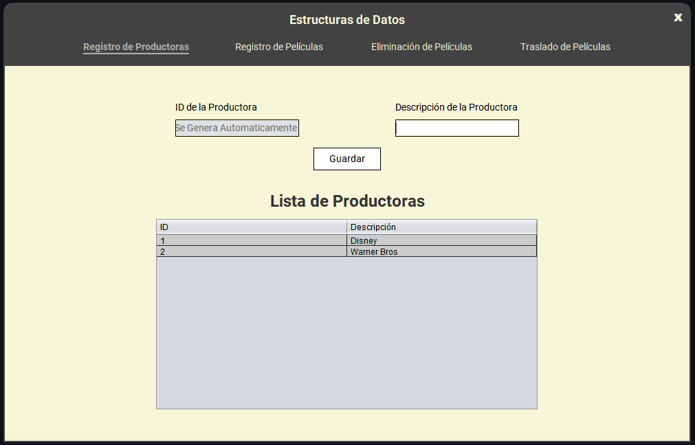
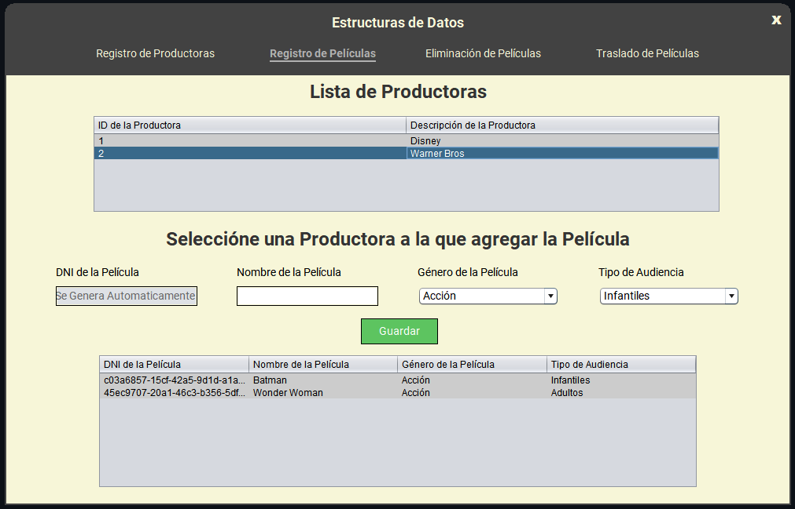
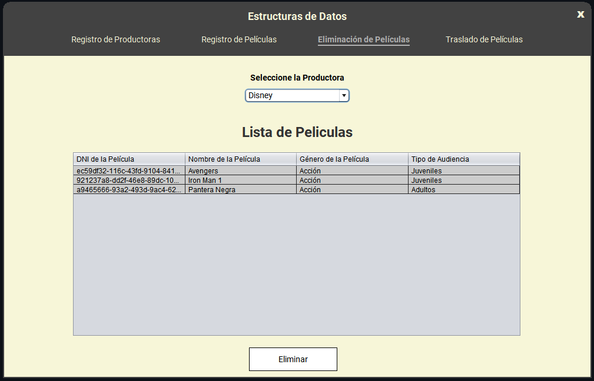
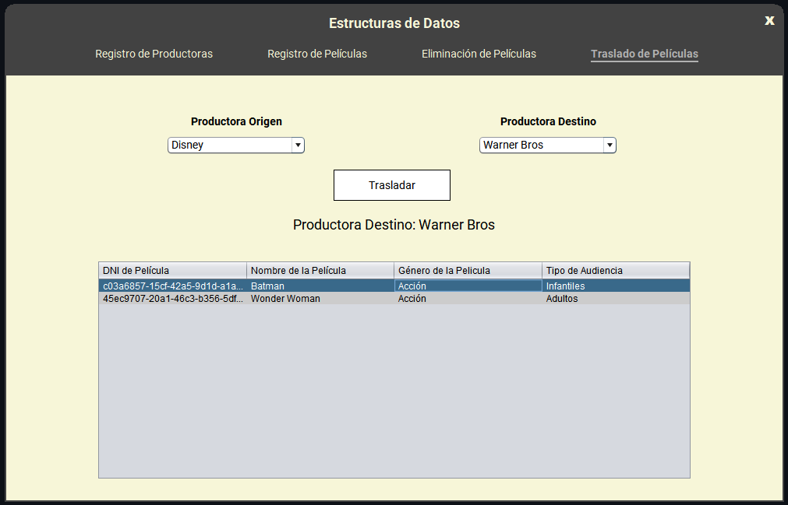

# CineProductoraManager

Este proyecto fue desarrollado para la asignatura "Estructura de Datos" de la UNED en el II Cuatrimestre de 2024. Es una aplicación gráfica en Java (NetBeans) que simula la gestión de productoras cinematográficas y sus películas utilizando estructuras de datos como pilas y colas implementadas con arreglos primitivos de objetos.

## Funcionalidades Principales

- **Registro de Productoras:** Se puede añadir nuevas productoras que se almacenan en una pila. Los datos incluyen un ID generado automáticamente y una descripción.

- **Registro de Películas:** Las películas se almacenan en una cola dentro de cada productora. Se pueden agregar nuevas películas asignando un identificador GUID, nombre, género y tipo de audiencia.

- **Eliminación de Películas:** Se eliminan automáticamente las películas registradas primero dentro de una productora.

- **Traslado de Películas:** Permite transferir todas las películas de una productora a otra.

También puedes ver el [Video Demostración](Demostración/Demo.mp4) completo.

## Estructuras de Datos Utilizadas

- **Pilas:** Para almacenar las productoras cinematográficas.
- **Colas:** Para almacenar las películas asociadas a cada productora.

## Requisitos

- NetBeans en su versión más reciente.
- Java 8 o superior.

## Instalación

1. Clona este repositorio.
2. Abre el proyecto en NetBeans.
3. Ejecuta la aplicación desde NetBeans.

## Notas

- No se utilizan colecciones de Java (como ArrayList o Queue), únicamente arreglos primitivos.
- Los datos no persisten después de cerrar la aplicación.
